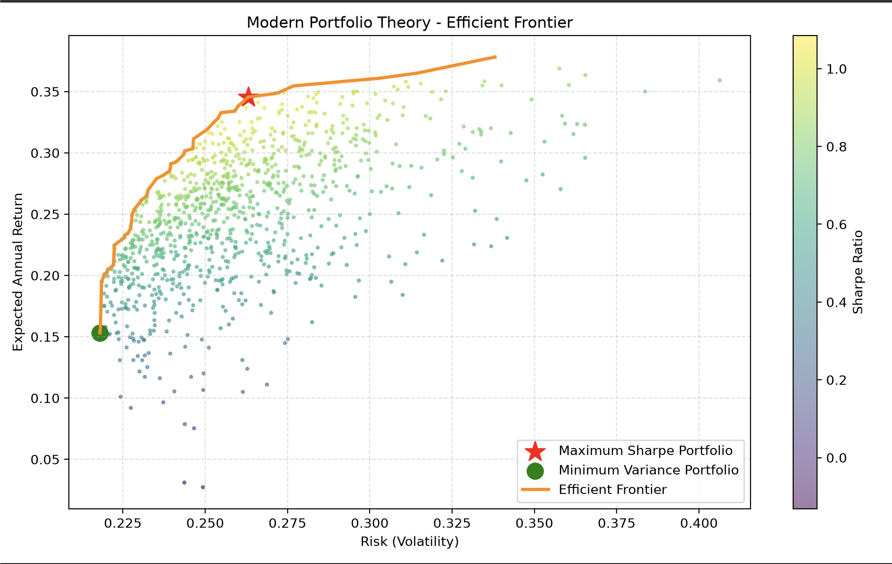

# 📈 Financial Portfolio Optimizer

A quantitative finance project that applies **Modern Portfolio Theory (MPT)** and **Monte Carlo Simulation** to identify an optimal portfolio allocation by maximizing the **Sharpe Ratio** using historical market data.

---

## Live Demo

🌐 **Live Demo:** [Launch Application](https://financial-portfolio-optimizer-monte-carlo.streamlit.app/)

---

## Built With

- Python
- FastAPI
- Streamlit
- NumPy
- Pandas
- SciPy
- Plotly
- Yahoo Finance

---

## Highlights

- Modern Portfolio Theory (MPT)
- Monte Carlo Simulation for portfolio optimization
- Maximum Sharpe Ratio portfolio selection
- Portfolio risk, expected return & Sharpe ratio analysis
- Interactive asset allocation visualization
- CSV export of optimized allocations

---

## Preview

